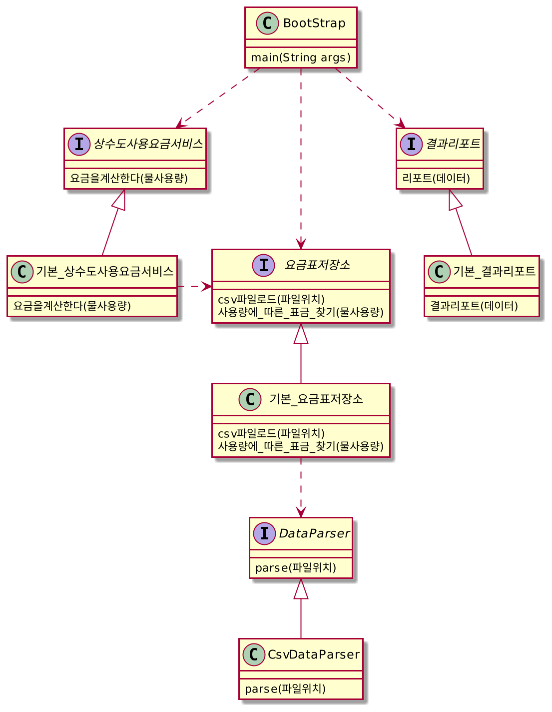

# SpringCore_WaterBill
## 요구사항1

* 제공하는 상수도 요금표를 메모리에 로드하고 사용자가 입력한 사용량에 따라 요금을 지자체별, 업종별로 표시하는 기능을 제공하세요.
* 가장 저렴한 가격(`billTotal`)을 가진 항목을 5개만 가격 오름차순으로 표시합니다.

### 입출력 예

```
> 1000
WaterBill{city='고령군', sector='공업용', unitPrice=370, billTotal=370000}
WaterBill{city='통영시', sector='원정수판매용', unitPrice=413, billTotal=413000}
WaterBill{city='금산군', sector='정수용', unitPrice=433, billTotal=433000}
WaterBill{city='나주시', sector='임시용(상)', unitPrice=433, billTotal=433000}
WaterBill{city='장흥군', sector='임시용(상)', unitPrice=433, billTotal=433000}
> 2000
WaterBill{city='고령군', sector='공업용', unitPrice=370, billTotal=740000}
WaterBill{city='통영시', sector='원정수판매용', unitPrice=413, billTotal=826000}
WaterBill{city='금산군', sector='정수용', unitPrice=433, billTotal=866000}
WaterBill{city='나주시', sector='임시용(상)', unitPrice=433, billTotal=866000}
WaterBill{city='장흥군', sector='임시용(상)', unitPrice=433, billTotal=866000}
> 3000
WaterBill{city='고령군', sector='공업용', unitPrice=370, billTotal=1110000}
WaterBill{city='통영시', sector='원정수판매용', unitPrice=413, billTotal=1239000}
WaterBill{city='금산군', sector='정수용', unitPrice=433, billTotal=1299000}
WaterBill{city='나주시', sector='임시용(상)', unitPrice=433, billTotal=1299000}
WaterBill{city='장흥군', sector='임시용(상)', unitPrice=433, billTotal=1299000}
>
```

### 설계 요구사항

* 다음의 역할을 하는 스프링빈을 각각 생성해야 합니다.
    * csv 파일을 파싱하는 스프링빈 (인터페이스 포함)
    * 결과를 화면에 표시하는 스프링빈 (인터페이스 포함)
    * 요금표 데이터를 저장하고 조회하는 역할을 하는 스프링빈
    * 입력받은 사용량으로 요금표에서 구간을 찾아내고 요금을 계산해 주는 스프링빈

### 논리 설계

``` uml
요구사항2
```

* 실행하는 스프링 빈의 모든 메소드의 실행시간을 elapse.log 파일에 저장하세요. (AOP 를 이용해야 합니다.)

## 요구사항3

* 테스트 코드를 작성하세요.
* 1차 SonarQube 테스트

<br>
## 요구사항4

* 원본 데이터가 CSV 형식에서 JSON 형식으로 변경되었습니다.
* JSON 포멧의 데이터를 읽어서 동일한 기능을 하도록 수정하세요.
* 가능하면 확장자에 따라 자동으로 parser 를 선택하도록 구현하세요.
* jackson 라이브러리를 사용하세요.

## 클래스 다이어그램


## SonarQube
링크 : http://133.186.211.156:9000/dashboard?id=com.nhnacademy.edu.springframework.project%3Aspringframework-project2-jojaecheol
<br>


<br>
var 부분 제외하고는 나머지 code smell 부분 다 제거함


# 정리
현재 main(BootStrap.class) 경우 요구사항 5인 JSON 파일을 읽어오는 정책에 맞게 구현 되어있습니다.
(JsonDataParser.class 빈에 @Primary가 걸려있습니다) <br>
<br>

단위 테스트 -> CSV 파일을 읽어오는 정책인 상황으로 가정하고 단위 테스트를 진행하였습니다.<br>
통합 테스트 -> 현재 main과 같이 JSON 파일을 읽어오는 정책인 상황에 맞게 통합 테스트를 진행하였습니다.
